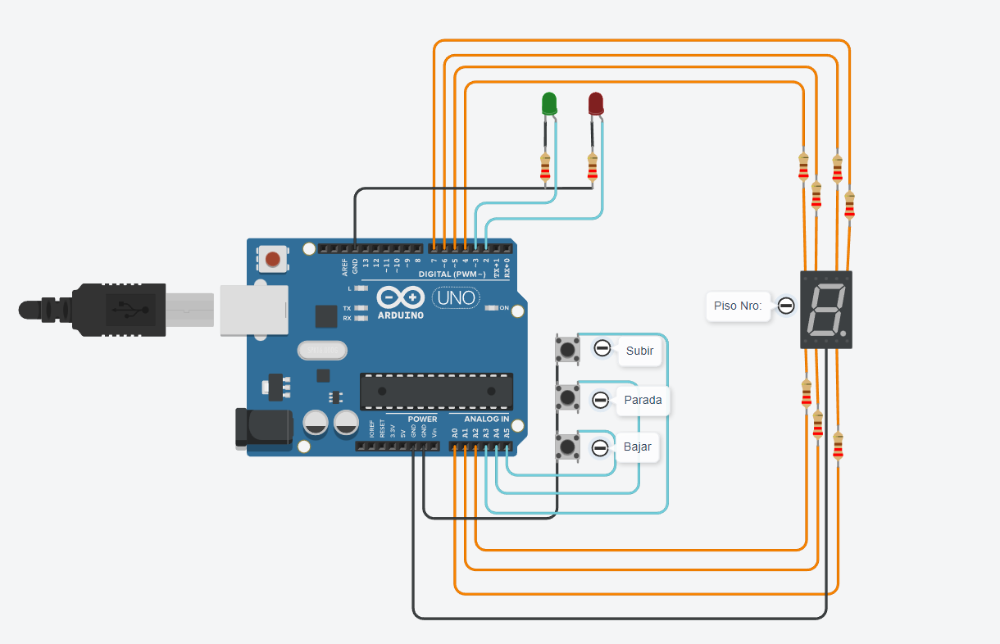
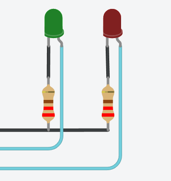
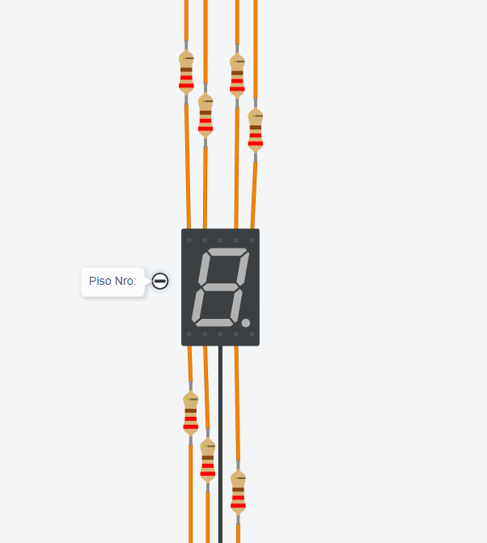
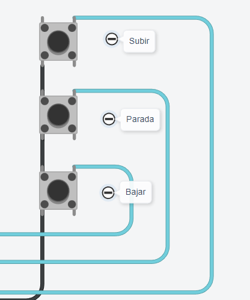

# Parcial 1 Sistema de Procesamiento de Datos

## Alumno y division

* Franco Yapura
*  1J 


## Proyecto: Maqueta de Montacargas



## Descripcion

El proyecto conecta 3 botones, un display de 7 segmentos y dos leds para simular un montacargas, en el que se puede subir o bajar desde el piso 0 al 9.

## Componentes

### Led roja/ led verde: 

Los leds son luces que pueden ser de distintos colores. Al catodo de los leds se los conecta a una resistencia y al GND, al anodo se lo conecta en el pin al que se asignará. 
En el código, los leds representarán el estado del montacargas, si el led verde está encendido el montacargas se está moviendo y si se presiona el botón de parada (o se intenta ir a un piso menor a 0 o mayor a 9) se encenderá el led rojo.
A cada led se le conecta una resistencia de 220 ohms en el cátodo.



### Visualizador de siete segmentos:  

Un display o visualizador de 7 segmentos es un dispositivo que consta de 7 luces leds (en realidad 8) que nos permiten formar numeros del 0 al 9. Cada led tiene asignada una letra (De la A hasta la G) las cuales deben ser relacionadas a un pin para que funcionen. Además de conectarlo al GND y determinar si será de cátodo común o ánodo común.
En el código, el visualizador representará el piso en el que está el montacarga.
Se conecta un cable en cada segmento del display junto a una resistencia de 220 ohms cada una, además de conectarse al GND y se lo asigna como Cátodo común.




### Botones: 
Un pulsador o botón está conformado por dos pares de patillas(1a/1b y 2a/2b) que no se conectan entre ellas. En el código podremos leer el estado de este pulsador y utilizarlo. Para usarlos se debe implementar una resistencia de 10KΩ o una resistencia pull up de Arduino.
En el código representarán un botón para subir, uno para bajar y el último como freno de emergencia.
Cada botón estará conectado al GND en 1a y a su respectivo pin en 2b.



## Código

### Asignación de pines e inicializacion de variables

Antes de empezar el código, se definen los pines, en este caso los leds son 2 y 3, Los segmentos del display van de 4 a 7 y de A0 hasta A2, por último los botones son A3, A4 y A5:

```C++
#define ledrojo 2
#define ledverde 3
#define G 4
#define F 5
#define A 6
#define B 7
#define E A2
#define D A1
#define C A0
#define subir A3
#define parada A4
#define bajar A5
```

Tambien se inicializan algunas variables para despúes:

```C++
int contador = 0;
bool continua = true;
bool valorAnterior = 0;
int segundoContador = 0;
```

### Declaracion de pines

Una vez conectado los elementos y definidos los pines se declara cual va a ser su funcion. Tanto los leds como el display de siete segmentos se definen como elementos de salida. Los botones se definen como entradas digitales, y también se los declara como "PULLUP" para ahorranos utilizar una resistencia. Por último se inicia un Serial:

```C++
void setup()
{
  pinMode(ledrojo, OUTPUT);
  pinMode(ledverde, OUTPUT);
  pinMode(A, OUTPUT);
  pinMode(B, OUTPUT);
  pinMode(C, OUTPUT);
  pinMode(D, OUTPUT);
  pinMode(E, OUTPUT);
  pinMode(F, OUTPUT);
  pinMode(G, OUTPUT);
  pinMode(subir, INPUT_PULLUP);
  pinMode(parada, INPUT_PULLUP);
  pinMode(bajar, INPUT_PULLUP);
  Serial.begin(9600);
}

```


### Funciones del loop 
```C++
void loop()
{ 
   if (continua)
  {
    digitalWrite(ledrojo, 0);
    verificarBotones();
    validarContador();
  }
  else
  {
    contador = segundoContador;
    digitalWrite(ledverde, 0);
    digitalWrite(ledrojo, 1);
    if(digitalRead(parada) == 0 && digitalRead(parada) != valorAnterior)
    {
      if(continua == false)
      {
        continua = true;
      }
    }
    valorAnterior = digitalRead(parada);
  }
}
```

En orden las funciones ocurririan de la siguiente manera (considerando que continua se inicializó como true):

#### "verificarBotones":

Esta función se encarga de verificar si se presiono el botón de subir o bajar para luego llamar otras funciones que continuen con el código:

```C++
void verificarBotones()
{
  switch (digitalRead(subir))
  {
    case 0:
    segundoContador = contador;
    contador ++;
    tresSegundos();
    if (continua == false)
    {
      break;
    }
    mostrarNumeros(contador); 
    digitalWrite(ledverde, 0);
    Serial.println(contador);
  }

  switch (digitalRead(bajar))
  {
    case 0:
    segundoContador = contador;
    contador --;
    tresSegundos();
    if (continua == false)
    {
      break;
    }
    mostrarNumeros(contador); 
    digitalWrite(ledverde, 0);
    Serial.println(contador);
  }
}

```

Se utiliza un switch para verificar que cuando el botón sea pulsado se sigan una serie de pasos: Primero, el numero del contador es guardado en la variable "segundoContador"(que se utilizará en caso de usar la parada de emergencia), luego dependiendo de que boton se presionó se suma o resta 1 al contador que simboliza el piso. Luego se llama a la funcion de "tresSegundos" y se verifica que "continua" sigue siendo verdadera, en caso de no ser así se utilizará un break para salir del while. Luego se llama a la funcion "mostrarNumeros" y se le pasa el contador, por último se apaga el led verde y se imprime por Serial el piso en el que se encuentra el montacargas.


#### "tresSegundos":

Esta función se encarga de encender el led verde y esperar los 3 segundos entre cada piso:

```C++
void tresSegundos()
{
  if (contador > -1 && contador < 10)
  {
    digitalWrite(ledverde, 1);
    for (int i=0; i<30; i++)
    {
      int valor = digitalRead(parada);
      if (valor == 0)
      {
        continua = false;
        break;
      }
      delay(100);
    }
  }
  else
  {
    mostrarNumeros(contador);
  }
}
```
Primero se verifica que el contador esté en el rango de 0 a 9, si es así se encenderá el led verde y luego a través de un for se esperarán 3 segundos en los cuales el usuario puede frenar el montacargas presionando el boton de parada. Esto provocaría que "continua" se declarara false y luego haya un break que salga del for (al ser false "continua" también se saldrá del while y no se podrá subir ni bajar, simulando una parada de emergencia). Si no se presiona el botón de parada transcurriran los 3 segundos normalmente y se volverá a "verificarBotones". 
Si la primera condicion no se cumple solamente se llamará a la funcion "mostrarNumeros" pasando el contador:


#### "mostrarNumeros":

La funcion se encarga mostrar el piso en el que está el montacargas por el display:

```C++
void mostrarNumeros(int display)
{
   switch(display)
   {
     case 0:
     apagar();
     encenderCero();
     break;
	 
     case 1:
     apagar();
     digitalWrite(B, 1);
     digitalWrite(C, 1);
     break;

     case 2:
     apagar();
     digitalWrite(A, 1);
     digitalWrite(B, 1);
     digitalWrite(D, 1);
     digitalWrite(E, 1);
     digitalWrite(G, 1);  
     break;

     case 3:
     apagar();
     digitalWrite(A, 1);
     digitalWrite(B, 1);
     digitalWrite(C, 1);
     digitalWrite(D, 1);
     digitalWrite(G, 1);
     break;
  
     case 4:
     apagar();
     digitalWrite(B, 1);
     digitalWrite(C, 1);
     digitalWrite(F, 1);
     digitalWrite(G, 1);
     break;

	 case 5:
     apagar();
     digitalWrite(A, 1);
     digitalWrite(C, 1);
     digitalWrite(D, 1);
     digitalWrite(F, 1);
     digitalWrite(G, 1);
     break;
  
	 case 6:
     apagar();
     digitalWrite(A, 1);
     digitalWrite(C, 1);
     digitalWrite(D, 1);
     digitalWrite(E, 1);
     digitalWrite(F, 1);
     digitalWrite(G, 1);
     break;
  
	 case 7:
     apagar();
     digitalWrite(A, 1);
     digitalWrite(B, 1);
     digitalWrite(C, 1);
     break;
  
	 case 8:
     apagar();
     digitalWrite(A, 1);
     digitalWrite(B, 1);
     digitalWrite(C, 1);
     digitalWrite(D, 1);
     digitalWrite(E, 1);
     digitalWrite(F, 1);
     digitalWrite(G, 1);
     break;

     case 9:
     apagar();
     digitalWrite(A, 1);
     digitalWrite(B, 1);
     digitalWrite(C, 1);
     digitalWrite(F, 1);
     digitalWrite(G, 1);
     break;
     
     case 10:
     case -1:
     digitalWrite(ledrojo, 1);
     delay(2000);
     digitalWrite(ledrojo, 0);
   }
}
```
La funcion recibe el numero del contador y lo verifica con un switch, si el numero está entre 0 y 9, se llama a la función "apagar", la cual apaga todos los leds del display, y luego se enciende los que el numero del contador indique. En caso de que el contador sea 10 o -1 se encenderá el led rojo indicando que no se puede subir/bajar otro piso. Luego se volverá a "tresSegundos" o "verificarBotones".

#### "apagar":

Se encarga de apagar el display:
```C++
void apagar()
{
  digitalWrite(A, 0);
  digitalWrite(B, 0);
  digitalWrite(C, 0);
  digitalWrite(D, 0);
  digitalWrite(E, 0);
  digitalWrite(F, 0);
  digitalWrite(G, 0);
  delay(200);
}
```
La funncion simplemente apaga todos los leds del display y espera 0,2 segundos (para luego encenderse los les del numero asignado)

#### "encenderCero":

La funcion se encarga de mostar el numero 0 en el display:

```C++
void encenderCero()
{
  digitalWrite(A, 1);
  digitalWrite(B, 1);
  digitalWrite(C, 1);
  digitalWrite(D, 1);
  digitalWrite(E, 1);
  digitalWrite(F, 1);
}
```
Solo se encienden los leds del numero 0 (esto ya que es el único número que se usa mas de una vez)

#### "validarDisplay":

Se encarga de asegurarse que el contador se mantenga en el rango de 0 a 9 y en encender el display apenas empiece el código:

```C++
void validarDisplay()
{
  if (contador > 9)
  {
    contador = 9;
  }
  if (contador < 0)
  {
    contador = 0;
  }
  if (contador == 0)
  {
    encenderCero();
  }
}
```
Consiste de tres if, en el primero, si el contador se pasa de nueve, vuelva este valor. En el segundo sucede lo mismo pero con el cero, si el contador desciende de 0, vuelve a ese valor. Por último, en el tercero se verifica que si contador está en 0 se enciendan todas sus luces, esto es para que al iniciarse el código se encienda el display con el numero 0.

### Botón de parada:

Para el botón de parada se asignan una serie de pasos específicos:
Al comenzar el código, "continua" es true por lo tanto se ejecutan las primeras funciones vistas ("verificarBotones" y "validarContador"). Si el código sigue normal y en los tres segundos de espera entre pisos se presiona el boton de parada, el for se romperá:

```C++
    int valor = digitalRead(parada);
    if (valor == 0) 
    {
    continua = false;
    break;
    }
```

Lo que al mismo tiempo hará que se rompa el while de "verificarBotones" ya que "continua" ahora es false:
```C++
if (continua == false)
    {
      break;
    }
```
Estó hará que se vuelva al loop en donde, al ser false "continua" se ejecuta el else:

```C++
 else
  {
    contador = segundoContador;
    digitalWrite(ledverde, 0);
    digitalWrite(ledrojo, 1);
    if(digitalRead(parada) == 0 && digitalRead(parada) != valorAnterior)
    {
        continua = true;
    }
    valorAnterior = digitalRead(parada);
  }
```
Esto hace que el contador se declare nuevamente con el valor de "SegundoContador" ya que se anula el valor anterior. Luego se enciende el led rojo y se apaga el verde, mostrando que la parada de emergencia se activó. Luego se verifica que el botón de parada haya sido pulsado nuevamente, y si es así el código volverá a la normalidad y se apagará el led rojo.
Para verificar que el botón haya sido pulsado se guarda el primer valor del digitalRead, el cual al principio es 1, por lo que a partir de la segunda vuelta si se presiona el boton se cumplen ambas condiciones y entrá al if.


## Link al proyecto

[tinkercard.com](https://www.tinkercad.com/things/lrOPFZKJB3U?sharecode=teO_2-SXaF-Spa9F4kaaMXgLMYUmJjnUbEb-yMCK6Ds)

## Consigna

[classroom.com](https://classroom.google.com/c/NTUyNTQzNTI4MjMw/m/NTUzODk0NDg2Mzkx/details)